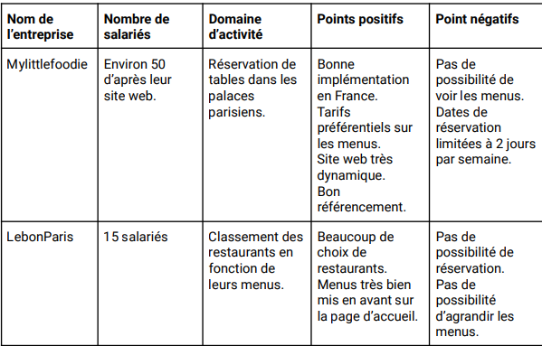

# Qui ?

La solution est pour une entreprise de commande de repas en-ligne se nommant ***Ohmyfood***

---

# Identification du besoin

***Ohmyfood*** a identifier un besoin au sein du marcher et souhaiterais créer une solution qui répond à ce besoin voici les problèmes identifiés

* Temps d'attente beaucoup trop long
* Pas d'asynchronisme le temps que le client étudie la carte et sélectionne ce qu'il souhaiterais consommer.

---
# Les propositions

Après identification des différentes problématique, l'entreprise ***Ohmyfood*** voudrais ce positionner cette fois-ci sur Paris, pour proposer à des temps de préparations/livraisons records de plat gastronomique.

---

# La cible

Elle vise plus particulièrement les personnes voulant avoir rapidement leurs plats sans attendre trop longtemps, avec des prix abordables pour les classes

* Moyenne
* Supérieur

---

# La solution

La solution serait de produire un site web défiant toutes concurrences afin de pallier aux différentes problématique rencontrer.

---
# Details de la solution

Deux grande phases projet doit être respecter avec une deadline de **1 mois** pour la première livraison du site. 

Cette date limite est en corrélation avec le budget client qui est à hauteur de **20 000 euro**. 

* **Phase 1**: Développer un site proposant le menu de 4 grands restaurants parisiens.
* **Phase 2** : Permettre la réservation en ligne et la composition de menus.

---

# Contraintes techniques global

- On doit respecter une **charte grahique** préciser dans le cahier des charges
- La méthode de production doit commencer par l'approche **Mobile First**.
- Pas de **javascript**
- Du code propre **CSS** avec un ou plusieurs fichiers dédier.
- Doit être versionné sur **github**.
- Doit être accessible depuis **github page** une fois finis.
- Site web de **4 page** proposant chacune une carte d'un restaurant partenaire.

---

# Les cas d'utilisations

---
# Validateur W3C

